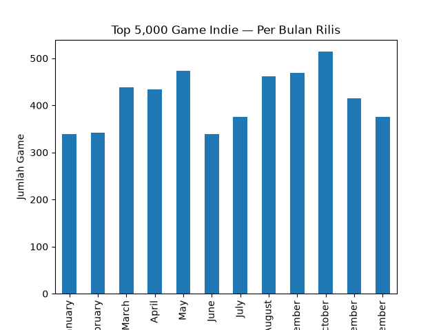

# analisis-game-indie-steam
Database ini berisi data 5000 appdetails yang diambil dari Steamspy dan Steam API per September 2026, berisi detail game, genre, tanggal rilis, harga, dll.
Data difilter dan disortir dengan metode wilson lower bound dan diranking berdasarkan total review dan wilson score.
Ranking tersebut kemudian dirata-ratakan 50/50 antar popularitas dan kualitas.

file data_final_merged_indie_games.csv adalah data final dan siap untuk diimport ke SQL 

## Temuan: Waktu Rilis Game Indie

Dari 5.000 game indie paling sukses di Steam (berdasarkan kombinasi popularitas dan kualitas ulasan), rilis game ternyata tidak tersebar merata sepanjang tahun, ada pengelompokan yang jelas di sekitar **September dan Oktober**. Kedua bulan menyumbang sekitar 20% dari seluruh rilis dalam dataset, dengan Oktober sebagai bulan paling ramai (514 game) dan September di posisi kedua (469 game). Sebaliknya, bulan-bulan paling sepi adalah Januari, Februari, dan Juni, yang masing-masing hanya berada di kisaran 339-342 game.

Pada level musim, pola ini semakin terlihat jelas: **rilis di musim Fall (1.398 game) lebih banyak sekitar 33% dibanding musim Winter (1.057 game)**  kesenjangan yang cukup signifikan.

Salah satu kemungkinan penjelasannya (meski ini masih berupa korelasi, bukan hubungan sebab-akibat yang terbukti): banyak developer sengaja menghindari rilis berdekatan dengan musim liburan akhir tahun (November-Desember), yang biasanya didominasi oleh rilis game-game AAA besar. Dengan merilis di September-Oktober, developer indie kemungkinan mencoba menangkap momentum belanja sebelum musim liburan, sekaligus menghindari persaingan langsung dengan judul-judul besar tersebut.
